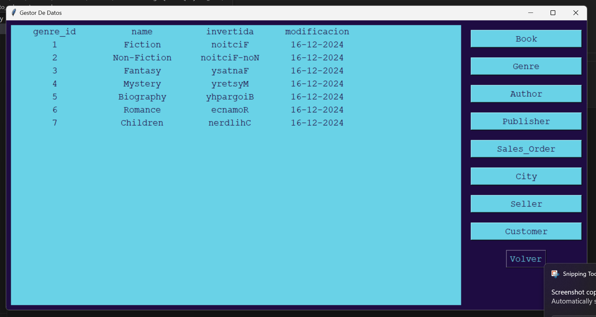
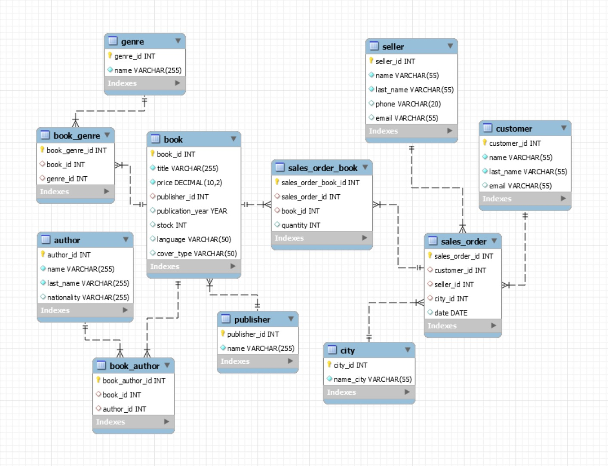

# Modernización del Sistema de Gestión de Datos

## Descripción del Proyecto

Este proyecto tiene como objetivo modernizar un sistema heredado que gestiona datos, mejorando su eficiencia, confiabilidad y usabilidad. Se ha diseñado e implementado un nuevo sistema utilizando una base de datos relacional y una aplicación en Python, garantizando una interfaz fácil de usar para la gestión de datos.

## Funcionalidades del Proyecto

### 1. Migración de Datos

El sistema incluye un script en Python que permite migrar datos de una base de datos MySQL a una nueva base de datos en SQL Server. Dentro de la carpeta `mysql_to_sqlserver` están cuatro archivos; en el archivo llamado `config.py` se modifican las credenciales de MySQL y SQL Server para realizar la migración. En `mssql_connection.py` se conecta a SQL Server y en `mysql_connection.py` se conecta a MySQL. Finalmente, en `value_migrate.py` ocurre la migración, estableciendo una conexión con la base de datos al iniciar y cerrándola al salir, manejando errores.

### 2. Interfaz de Usuario con Python Tkinter

Se ha desarrollado una interfaz gráfica utilizando la biblioteca Tkinter de Python, permitiendo a los usuarios gestionar la base de datos migrada con las siguientes funcionalidades:

- **Visualización de Registros**: Muestra los datos de las tablas en una lista o tabla dentro de la interfaz.
- **Adición de Registros**: Proporciona un formulario para ingresar nuevos datos en las tablas.
- **Modificación de Registros**: Permite la edición de registros existentes de forma intuitiva.
- **Eliminación de Registros**: Facilita la eliminación segura de registros seleccionados.

## Defensa de Nicole Lozada Leon

Agregar una columna "invertida" a la tabla "genre" donde deben estar los valores de la columna "name invertidos.

## Esctructura del proyecto 

## Pruebas de la Solución

Se han implementado pruebas para asegurar que todas las funcionalidades de la interfaz funcionen correctamente:

1. **Pruebas de las Acciones Principales**:
   - Verificación de que los datos se muestren correctamente en la interfaz.
     
   - Confirmación de que las operaciones de adición, modificación y eliminación actualicen la base de datos.
     
     **Agregar**
     
     

     
     **Modificar**
     
     
     **Eliminar**
     
     

2. **Validación de Entradas**:
   - Manejo adecuado de errores de entrada (campos vacíos, formatos incorrectos, etc.).
     
   - Mensajes claros en caso de errores.
     

3. **Pruebas de Integridad de Datos**:
   - Verificación de que los cambios realizados desde la interfaz se reflejen correctamente en la base de datos.
     

4. **Pruebas de Cierre de Conexión**:
   - Verificación de que la conexión a la base de datos se cierre correctamente al cerrar la aplicación.
     

### Modelo de Entidad-Relación

## Colaboradoras

- **Nicole Lozada León**  
  Email: [nicole.lozada@ucb.edu.bo](mailto:nicole.lozada@ucb.edu.bo)

- **Dariana Pol Aramayo**  
  Email: [dariana.pol@ucb.edu.bo](mailto:dariana.pol@ucb.edu.bo)

## Universidad

**Universidad Católica Boliviana**  
Ciudad: Santa Cruz

## Conclusión

Este proyecto ha logrado modernizar y optimizar la gestión de datos en la empresa, asegurando que el nuevo sistema sea robusto, eficiente y fácil de usar. La interfaz gráfica y la migración de datos han sido implementadas con éxito, proporcionando una solución confiable para la gestión de información.

