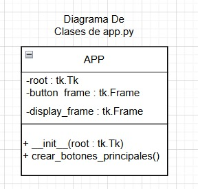
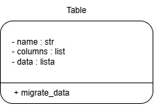
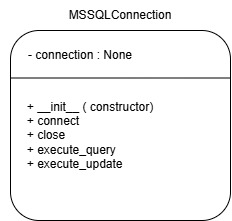

# Modernización del Sistema de Gestión de Datos

## Descripción del Proyecto

Este proyecto tiene como objetivo modernizar un sistema heredado que gestiona datos, mejorando su eficiencia, confiabilidad y usabilidad. Se ha diseñado e implementado un nuevo sistema utilizando una base de datos relacional y una aplicación en Python, garantizando una interfaz fácil de usar para la gestión de datos.

## Funcionalidades del Proyecto

### 1. Migración de Datos

El sistema incluye un script en Python que permite migrar datos de una base de datos MySQL a una nueva base de datos en SQL Server. Dentro de la carpeta `mysql_to_sqlserver` están cuatro archivos; en el archivo llamado `config.py` se modifican las credenciales de MySQL y SQL Server para realizar la migración. En `mssql_connection.py` se conecta a SQL Server y en `mysql_connection.py` se conecta a MySQL. Finalmente, en `value_migrate.py` ocurre la migración, estableciendo una conexión con la base de datos al iniciar y cerrándola al salir, manejando errores.

### 2. Interfaz de Usuario con Python Tkinter

Se ha desarrollado una interfaz gráfica utilizando la biblioteca Tkinter de Python, permitiendo a los usuarios gestionar la base de datos migrada con las siguientes funcionalidades:

- **Visualización de Registros**: Muestra los datos de las tablas en una lista o tabla dentro de la interfaz.
- **Adición de Registros**: Proporciona un formulario para ingresar nuevos datos en las tablas.
- **Modificación de Registros**: Permite la edición de registros existentes de forma intuitiva.
- **Eliminación de Registros**: Facilita la eliminación segura de registros seleccionados.

## Pruebas de la Solución

Se han implementado pruebas para asegurar que todas las funcionalidades de la interfaz funcionen correctamente:

1. **Pruebas de las Acciones Principales**:
   - Verificación de que los datos se muestren correctamente en la interfaz.
     
   - Confirmación de que las operaciones de adición, modificación y eliminación actualicen la base de datos.
     
     **Agregar**
     
     

     
     **Modificar**
     
     
     **Eliminar**
     
     

2. **Validación de Entradas**:
   - Manejo adecuado de errores de entrada (campos vacíos, formatos incorrectos, etc.).
     
   - Mensajes claros en caso de errores.
     

3. **Pruebas de Integridad de Datos**:
   - Verificación de que los cambios realizados desde la interfaz se reflejen correctamente en la base de datos.
     

4. **Pruebas de Cierre de Conexión**:
   - Verificación de que la conexión a la base de datos se cierre correctamente al cerrar la aplicación.
     

## Gráficos del Proyecto

A continuación se presentan los diagramas que ilustran la estructura y el funcionamiento del sistema:

### Modelo de Entidad-Relación

### Diagrama de Clases - Interfaz

### Diagrama de Clases - Migración de Datos

### Diagrama de Clases - Conexión MySQL

### Diagrama de Clases - Conexión SQL Server

### Pseudocodigo - value_migrate
    FUNCIÓN migrate_data
        mysql_conn = CONEXIÓN_MYSQL()
        mssql_conn = CONEXIÓN_MSSQL()

        TRATAR
            mysql_conn.conectar()
            mssql_conn.conectar()

            db_name = CONFIGURACIÓN_MYSQL['database']
            use_db_query = "USE " + db_name + ";"
            mssql_conn.ejecutar_actualización(use_db_query)

            // Verificar si la base de datos MS SQL Server está vacía
            check_empty_db_query = "SELECT COUNT(*) AS TotalTablas FROM INFORMATION_SCHEMA.TABLES;"
            resultado = mssql_conn.ejecutar_consulta(check_empty_db_query)
            tablas_db = resultado[0]

            // Asegúrate de que el resultado sea una lista de diccionarios
            SI tablas_db[0] == 0 ENTONCES
                // Obtener nombres de tablas de MySQL
                tablas = mysql_conn.ejecutar_consulta("SHOW TABLES;")
                IMPRIMIR "Tablas recuperadas de MySQL: " + tablas

                foreign_keys_list = []

                // Iniciar transacción
                mssql_conn.ejecutar_actualización("BEGIN TRANSACTION;")

                TRATAR
                    PARA CADA tabla EN tablas HACER
                        table_name = tabla['Tables_in_' + db_name]
                        IMPRIMIR "Migrando tabla: " + table_name

                        // Verificar si la tabla existe en MS SQL Server
                        table_exists_query = "SELECT * FROM INFORMATION_SCHEMA.TABLES WHERE TABLE_NAME = '" + table_name + "';"
                        table_exists = mssql_conn.ejecutar_consulta(table_exists_query)

                        SI NO table_exists ENTONCES
                            // Obtener esquema de tabla de MySQL
                            schema_query = "SHOW COLUMNS FROM " + table_name + ";"
                            columnas = mysql_conn.ejecutar_consulta(schema_query)

                            // Obtener información de clave primaria
                            primary_key_query = "SHOW KEYS FROM " + table_name + " WHERE Key_name = 'PRIMARY';"
                            primary_keys = mysql_conn.ejecutar_consulta(primary_key_query)

                            // Obtener información de clave foránea
                            foreign_key_query = """
                                SELECT
                                    kcu.constraint_name,
                                    kcu.table_name,
                                    kcu.column_name,
                                    kcu.referenced_table_name,
                                    kcu.referenced_column_name
                                FROM
                                    information_schema.table_constraints AS tc
                                    JOIN information_schema.key_column_usage AS kcu
                                    ON tc.constraint_name = kcu.constraint_name
                                    AND tc.table_schema = kcu.table_schema
                                WHERE
                                    tc.constraint_type = 'FOREIGN KEY' AND
                                    tc.table_name = '""" + table_name + """';
                            """
                            foreign_keys = mysql_conn.ejecutar_consulta(foreign_key_query)

                            // Verificar si la tabla tiene claves foráneas
                            SI foreign_keys ENTONCES
                                foreign_keys_list.extend(foreign_keys)

                            // Crear tabla en MS SQL Server con tipos de datos corregidos
                            create_table_query = "CREATE TABLE " + table_name + " ("
                            PARA CADA columna EN columnas HACER
                                col_name = columna['Field']
                                col_type = columna['Type']

                                // Mapear tipo de datos de MySQL a tipo de datos de SQL Server
                                col_type_parts = col_type.split('(')
                                base_type = col_type_parts[0]
                                mapped_type = data_type_mapping.get(base_type, 'VARCHAR')

                                SI LONGITUD(col_type_parts) > 1 ENTONCES
                                    // Manejar tipos con especificación de longitud
                                    longitud = col_type_parts[1].replace(')', '')
                                    mapped_type += "(" + longitud + ")"

                                create_table_query += col_name + " " + mapped_type + ", "

                            // Agregar restricción de clave primaria
                            SI primary_keys ENTONCES
                                primary_key_columns = [key['Column_name'] PARA key EN primary_keys]
                                primary_key_constraint = "PRIMARY KEY (" + ', '.join(primary_key_columns) + ")"
                                create_table_query += primary_key_constraint

                            create_table_query = create_table_query.rstrip(', ') + ");"
                            mssql_conn.ejecutar_actualización(create_table_query)

                EXCEPTO EXCEPCIÓN COMO e
                    // Revertir transacción en caso de error
                    mssql_conn.ejecutar_actualización("ROLLBACK;")
                    IMPRIMIR "Error durante la creación de la tabla o la adición de claves foráneas: " + e
                    RETORNAR

                // Insertar datos en las tablas
                PARA CADA tabla EN tablas HACER
                    table_name = tabla['Tables_in_' + db_name]
                    IMPRIMIR "Insertando datos en la tabla: " + table_name

                    // Obtener datos de MySQL
                    data_query = "SELECT * FROM " + table_name + ";"
                    datos = mysql_conn.ejecutar_consulta(data_query)

                    // Insertar datos en MS SQL Server
                    PARA CADA fila EN datos HACER
                        insert_query = "INSERT INTO " + table_name + " VALUES ("
                        PARA CADA valor EN fila.values() HACER
                            SI TIPO(valor) ES CADENA ENTONCES
                                insert_query += "'" + valor.replace("'", "''") + "', "  // Escapar comillas simples
                            SINO
                                insert_query += "'" + valor + "', "
                        insert_query = insert_query.rstrip(', ') + ");"
                        TRATAR
                            mssql_conn.ejecutar_actualización(insert_query)
                        EXCEPTO EXCEPCIÓN COMO e
                            IMPRIMIR "Error: " + e  // Mostrar el error pero continuar con el siguiente registro

                // Agregar restricciones de clave foránea a MS SQL Server
                PARA CADA fk EN foreign_keys_list HACER
                    constraint_name = fk['CONSTRAINT_NAME']
                    table_name = fk['TABLE_NAME']
                    column_name = fk['COLUMN_NAME']
                    referenced_table_name = fk['REFERENCED_TABLE_NAME']
                    referenced_column_name = fk['REFERENCED_COLUMN_NAME']

                    alter_table_query = """
                    ALTER TABLE """ + table_name + """
                    ADD CONSTRAINT """ + constraint_name + """
                    FOREIGN KEY (""" + column_name + """)
                    REFERENCES """ + referenced_table_name + """ (""" + referenced_column_name + """);
                    """

                    TRATAR
                        mssql_conn.ejecutar_actualización(alter_table_query)
                        IMPRIMIR "Restricción de clave foránea agregada exitosamente a la tabla '" + table_name + "'."
                    EXCEPTO EXCEPCIÓN COMO e
                        IMPRIMIR "Error al agregar restricción de clave foránea a la tabla '" + table_name + "': " + e

                // Agregar columna "modificación" a cada tabla existente
                PARA CADA tabla EN tablas HACER
                    table_name = tabla['Tables_in_' + db_name]
                    IMPRIMIR "Agregando columna 'modificación' a la tabla: " + table_name

                    // Verificar si la columna ya existe
                    check_column_query = """
                        SELECT COLUMN_NAME FROM INFORMATION_SCHEMA.COLUMNS
                        WHERE TABLE_NAME = '""" + table_name + """' AND COLUMN_NAME = 'modificacion';
                    """
                    column_exists = mssql_conn.ejecutar_consulta(check_column_query)

                    SI NO column_exists ENTONCES
                        alter_table_query = "ALTER TABLE " + table_name + " ADD modificacion DATETIME;"
                        TRATAR
                            mssql_conn.ejecutar_actualización(alter_table_query)
                            IMPRIMIR "Columna 'modificación' agregada a la tabla: " + table_name
                        EXCEPTO EXCEPCIÓN COMO e
                            IMPRIMIR "Error al agregar columna 'modificación' a la tabla " + table_name + ": " + e

        EXCEPTO EXCEPCIÓN COMO e
            IMPRIMIR "Error durante la migración: " + e
        FINALMENTE
            mysql_conn.cerrar()
            mssql_conn.cerrar()
    FIN FUNCIÓN

### Pseudocodigos - Clase: mysql_connection
    // Método para conectar a la base de datos MySQL
    FUNCIÓN connect
        TRATAR
            self.connection = CONECTAR_A_MYSQL(CONFIGURACIÓN_MYSQL)
            SI self.connection.está_conectado() ENTONCES
                IMPRIMIR 'Conectado a la base de datos MySQL'
        EXCEPTO ERROR COMO e
            IMPRIMIR 'Error: ' + e
    FIN FUNCIÓN

    // Método para cerrar la conexión a la base de datos MySQL
    FUNCIÓN close
        SI self.connection NO ES NULO ENTONCES
            self.connection.cerrar()
            IMPRIMIR 'Conexión a MySQL cerrada'
    FIN FUNCIÓN

    // Método para ejecutar una consulta SQL y devolver los resultados
    FUNCIÓN execute_query(consulta)
        TRATAR
            cursor = self.connection.cursor(diccionario=VERDADERO)
            cursor.ejecutar(consulta)
            resultado = cursor.obtener_todos()
            RETORNAR resultado
        EXCEPTO ERROR COMO e
            IMPRIMIR 'Error: ' + e
            RETORNAR NULO
    FIN FUNCIÓN

    // Método para ejecutar una consulta SQL de actualización (INSERT, UPDATE, DELETE)
    FUNCIÓN execute_update(consulta)
        TRATAR
            cursor = self.connection.cursor()
            cursor.ejecutar(consulta)
            self.connection.confirmar()
        EXCEPTO ERROR COMO e
            IMPRIMIR 'Error: ' + e
    FIN FUNCIÓN

### Pseudocodigos - mssql_connection
    // Método para conectar a la base de datos MS SQL Server
    FUNCIÓN connect
        TRATAR
            // Conectar a la base de datos maestra para crear una nueva base de datos
            self.connection = CONECTAR_A_MSSQL(
                "DRIVER=" + MSSQL_CONFIG['driver'] + "; " +
                "SERVER=" + MSSQL_CONFIG['server'] + ";" +
                "DATABASE=master;" +
                "Trusted_Connection=" + MSSQL_CONFIG['trusted_connection'] + ";"
            )
            IMPRIMIR 'Conectado a la base de datos maestra de MS SQL Server'

            // Crear la base de datos si no existe
            database_name = MYSQL_CONFIG['database']
            create_db_query = """
            IF NOT EXISTS (SELECT name FROM sys.databases WHERE name = '""" + database_name + """')
            BEGIN
                CREATE DATABASE [""" + database_name + """];
            END;
            """

            // Usar una conexión separada para crear la base de datos
            CON CONEXIÓN_TEMPORAL = CONECTAR_A_MSSQL(
                "DRIVER=" + MSSQL_CONFIG['driver'] + "; " +
                "SERVER=" + MSSQL_CONFIG['server'] + ";" +
                "DATABASE=master;" +
                "Trusted_Connection=" + MSSQL_CONFIG['trusted_connection'] + ";",
                autocommit=VERDADERO  // Establecer autocommit en True
            ) COMO temp_connection:
                cursor = temp_connection.cursor()
                cursor.ejecutar(create_db_query)
                // IMPRIMIR 'Base de datos ' + database_name + ' creada o ya existe'

            // Reconectar a la base de datos recién creada o existente
            self.connection = CONECTAR_A_MSSQL(
                "DRIVER=" + MSSQL_CONFIG['driver'] + "; " +
                "SERVER=" + MSSQL_CONFIG['server'] + ";" +
                "DATABASE=" + database_name + ";" +
                "Trusted_Connection=" + MSSQL_CONFIG['trusted_connection'] + ";"
            )
            IMPRIMIR 'Conectado a la base de datos ' + database_name + ' de MS SQL Server'

        EXCEPTO ERROR COMO e
            IMPRIMIR 'Error: ' + e
    FIN FUNCIÓN

    // Método para cerrar la conexión a la base de datos MS SQL Server
    FUNCIÓN close
        SI self.connection NO ES NULO ENTONCES
            self.connection.cerrar()
            IMPRIMIR 'Conexión a MS SQL Server cerrada'
    FIN FUNCIÓN

    // Método para ejecutar una consulta SQL y devolver los resultados
    FUNCIÓN execute_query(consulta)
        TRATAR
            cursor = self.connection.cursor()
            cursor.ejecutar(consulta)
            resultado = cursor.obtener_todos()
            RETORNAR resultado
        EXCEPTO ERROR COMO e
            IMPRIMIR 'Error: ' + e
            RETORNAR NULO
    FIN FUNCIÓN

    // Método para ejecutar una consulta SQL de actualización (INSERT, UPDATE, DELETE)
    FUNCIÓN execute_update(consulta)
        TRATAR
            cursor = self.connection.cursor()
            cursor.ejecutar(consulta)
            self.connection.confirmar()
        EXCEPTO ERROR COMO e
            IMPRIMIR 'Error: ' + e
    FIN FUNCIÓN

### Pseudocodigos - thinker_app
      SI __name__ == "__main__" ENTONCES
    root = tk.Tk()
    app = App(root)
    root.mainloop()

FUNCION App(root):
    self.root = root
    self.root.geometry(SIZE_WINDOW)
    self.root.title("Gestor De Datos")
    self.root.configure(bg=DARK_COLOR)

    self.button_frame = tk.Frame(self.root, bg=DARK_COLOR)
    self.button_frame.pack(side=tk.RIGHT, fill=tk.Y, padx=10, pady=10)

    self.display_frame = tk.Frame(self.root, bg=LIGHT_COLOR)
    self.display_frame.pack(side=tk.LEFT, fill=tk.BOTH, expand=True, padx=10, pady=10)

    self.crear_botones_principales()

FUNCION crear_botones_principales(self):
    PARA CADA widget EN self.button_frame.winfo_children() HACER
        widget.destroy()

    tk.Label(self.button_frame, text="Gestion de Datos", bg=DARK_COLOR, fg=LIGHT_COLOR, font=FONT).pack(BUTTON_DIRECTION)

    tk.Button(
        self.button_frame,
        text="Visualizar registros",
        command=lambda: see(self.button_frame, self.display_frame, types, self.crear_botones_principales),
        width=BUTTON_WIDTH,
        bg=LIGHT_COLOR,
        fg=DARK_COLOR,
        font=FONT
    ).pack(BUTTON_DIRECTION)

    tk.Button(
        self.button_frame,
        text="Agregar registros",
        command=lambda: add(self.button_frame, self.display_frame, types, self.crear_botones_principales),
        width=BUTTON_WIDTH,
        bg=LIGHT_COLOR,
        fg=DARK_COLOR,
        font=FONT
    ).pack(BUTTON_DIRECTION)

    tk.Button(
        self.button_frame,
        text="Modificar registros",
        command=lambda: mod(self.button_frame, self.display_frame, types, self.crear_botones_principales),
        width=BUTTON_WIDTH,
        bg=LIGHT_COLOR,
        fg=DARK_COLOR,
        font=FONT
    ).pack(BUTTON_DIRECTION)

    tk.Button(
        self.button_frame,
        text="Eliminar registros",
        command=lambda: delete(self.button_frame, self.display_frame, types, self.crear_botones_principales),
        width=BUTTON_WIDTH,
        bg=LIGHT_COLOR,
        fg=DARK_COLOR,
        font=FONT
    ).pack(BUTTON_DIRECTION)

    tk.Button(
        self.button_frame,
        text="Salir",
        command=self.root.destroy,
        width=BUTTON_WIDTH,
        bg=LIGHT_COLOR,
        fg=DARK_COLOR,
        font=FONT
    ).pack(BUTTON_DIRECTION)

FUNCION see(button_frame, display_frame, types, crear_botones_principales):
    PARA CADA widget EN button_frame.winfo_children():
        widget.destroy()

    PARA CADA record_type EN types:
        tk.Button(
            button_frame,
            text=record_type,
            width=BUTTON_WIDTH,
            bg=LIGHT_COLOR,
            fg=DARK_COLOR,
            font=FONT,
            command=lambda rt=record_type: display_records(display_frame, rt)
        ).pack(pady=10)

    tk.Button(
        button_frame,
        text="Volver",
        command=lambda: crear_botones_principales(),
        bg=DARK_COLOR,
        fg=LIGHT_COLOR,
        font=FONT
    ).pack(pady=10)

FUNCION display_records(display_frame, record_type):
    PARA CADA widget EN display_frame.winfo_children():
        widget.destroy()

    conn = connect_db()
    cursor = conn.cursor()

    TRY:
        cursor.execute(f"SELECT * FROM {record_type}")
        records = cursor.fetchall()

        headers = [desc[0] for desc in cursor.description]
        header_frame = tk.Frame(display_frame, bg=LIGHT_COLOR)
        header_frame.pack(fill=tk.X)

        PARA CADA header EN headers:
            tk.Label(header_frame, text=header, bg=LIGHT_COLOR, fg=DARK_COLOR, font=FONT, width=15).pack(side=tk.LEFT, padx=5)

        PARA CADA record EN records:
            row_frame = tk.Frame(display_frame, bg=LIGHT_COLOR)
            row_frame.pack(fill=tk.X)
            PARA CADA value EN record:
                tk.Label(row_frame, text=str(value), bg=LIGHT_COLOR, fg=DARK_COLOR, font=FONT, width=15).pack(side=tk.LEFT, padx=5)

    EXCEPT Exception AS e:
        tk.Label(display_frame, text=f"Error: {str(e)}", bg=LIGHT_COLOR, fg="red", font=FONT).pack(pady=5)

    cursor.close()
    conn.close()

FUNCION add(button_frame, display_frame, types, crear_botones_principales):
    PARA CADA widget EN button_frame.winfo_children():
        widget.destroy()

    PARA CADA record_type EN types:
        tk.Button(
            button_frame,
            text=record_type,
            width=BUTTON_WIDTH,
            bg=LIGHT_COLOR,
            fg=DARK_COLOR,
            font=FONT,
            command=lambda rt=record_type: add_record(display_frame, rt)
        ).pack(pady=10)

    tk.Button(
        button_frame,
        text="Volver",
        command=lambda: crear_botones_principales(),
        bg=DARK_COLOR,
        fg=LIGHT_COLOR,
        font=FONT
    ).pack(pady=10)

FUNCION add_record(display_frame, record_type):
    nueva_ventana = tk.Toplevel()
    nueva_ventana.title("Agregar Registros")
    nueva_ventana.geometry(SIZE_SECOND_WINDOW)
    nueva_ventana.config(bg=LIGHT_COLOR)

    inputs = []
    TRY:
        conn = connect_db()
        cursor = conn.cursor()

        cursor.execute(f"SELECT * FROM {record_type} WHERE 1=0")
        headers = [desc[0] for desc in cursor.description]

        PARA CADA header EN headers[:-1]:
            tk.Label(nueva_ventana, text=f"{header}:", bg=LIGHT_COLOR).pack()
            entry = tk.Entry(nueva_ventana)
            entry.pack()
            inputs.append(entry)

    EXCEPT Exception AS e:
        tk.Label(nueva_ventana, text=f"Error: {str(e)}", bg=LIGHT_COLOR, fg="red").pack()
        RETURN

    FUNCION submit():
        values = [entry.get() for entry in inputs]
        TRY:
            modification_date = datetime.now().strftime("%Y-%m-%d %H:%M:%S")
            placeholders = ", ".join(["?" for _ in headers])
            query = f"INSERT INTO {record_type} ({', '.join(headers)}) VALUES ({placeholders})"
            cursor.execute(query, values + [modification_date])

            SI record_type == "table1" ENTONCES:
                other_table_query = "INSERT INTO other_table (column1, column2) VALUES (?, ?)"
                cursor.execute(other_table_query, (values[0], values[1]))

            conn.commit()
            nueva_ventana.destroy()
            display_records(display_frame, record_type)
        EXCEPT Exception AS e:
            tk.Label(nueva_ventana, text=f"Error: {str(e)}", bg=LIGHT_COLOR, fg="red").pack()

    tk.Button(nueva_ventana, text="Agregar", command=submit).pack()
    tk.Button(nueva_ventana, text="Cerrar", command=nueva_ventana.destroy).pack()

    nueva_ventana.protocol("WM_DELETE_WINDOW", lambda: (cursor.close(), conn.close(), nueva_ventana.destroy()))

FUNCION mod(button_frame, display_frame, types, crear_botones_principales):
    PARA CADA widget EN button_frame.winfo_children():
        widget.destroy()

    PARA CADA record_type EN types:
        tk.Button(
            button_frame,
            text=record_type,
            width=BUTTON_WIDTH,
            bg=LIGHT_COLOR,
            fg=DARK_COLOR,
            font=FONT,
            command=lambda rt=record_type: mod_record(display_frame, rt)
        ).pack(pady=10)

    tk.Button(
        button_frame,
        text="Volver",
        command=lambda: crear_botones_principales(),
        bg=DARK_COLOR,
        fg=LIGHT_COLOR,
        font=FONT
    ).pack(pady=10)

FUNCION mod_record(display_frame, record_type):
    nueva_ventana = tk.Toplevel()
    nueva_ventana.title(f"Modificar {record_type}")
    nueva_ventana.geometry(SIZE_SECOND_WINDOW)
    nueva_ventana.config(bg=LIGHT_COLOR)

    tk.Label(nueva_ventana, text=f"Ingrese el valor de la clave primaria para modificar:", bg=LIGHT_COLOR).pack()
    primary_key_entry = tk.Entry(nueva_ventana)
    primary_key_entry.pack()

    inputs = []
    TRY:
        conn = connect_db()
        cursor = conn.cursor()

        cursor.execute(f"SELECT * FROM {record_type} WHERE 1=0")
        headers = [desc[0] for desc in cursor.description]

        PARA CADA header EN headers[1:-1]:
            tk.Label(nueva_ventana, text=f"{header}:", bg=LIGHT_COLOR).pack()
            entry = tk.Entry(nueva_ventana)
            entry.pack()
            inputs.append(entry)

    EXCEPT Exception AS e:
        tk.Label(nueva_ventana, text=f"Error: {str(e)}", bg=LIGHT_COLOR, fg="red").pack()
        RETURN

    FUNCION load_record():
        TRY:
            pk_value = primary_key_entry.get().strip()
            SI NO pk_value:
                RAISE ValueError("El valor de la clave primaria no puede estar vacío.")

            cursor.execute(f"SELECT * FROM {record_type} WHERE {headers[0]} = ?", (pk_value,))
            current_data = cursor.fetchone()

            SI NO current_data:
                RAISE ValueError(f"No se encontró ningún registro con {headers[0]} = {pk_value}")

            PARA CADA entry, value EN zip(inputs, current_data[1:-1]):
                entry.delete(0, tk.END)
                entry.insert(0, value)

        EXCEPT Exception AS e:
            tk.Label(nueva_ventana, text=f"Error: {str(e)}", bg=LIGHT_COLOR, fg="red").pack()

    FUNCION submit():
        TRY:
            values = [entry.get().strip() for entry in inputs]
            SI ALGUN value == "" ENTONCES:
                RAISE ValueError("Todos los campos son obligatorios.")

            modification_date = datetime.now().strftime("%Y-%m-%d %H:%M:%S")
            values.append(modification_date)

            set_clause = ", ".join([f"{header} = ?" for header in headers[1:-1]])
            query = f"UPDATE {record_type} SET {set_clause}, modificacion = ? WHERE {headers[0]} = ?"

            CON connect_db() COMO conn:
                cursor = conn.cursor()
                cursor.execute(query, values + [primary_key_entry.get().strip()])
                conn.commit()

            nueva_ventana.destroy()
            display_records(display_frame, record_type)
        EXCEPT Exception AS e:
            tk.Label(nueva_ventana, text=f"Error: {str(e)}", bg=LIGHT_COLOR, fg="red").pack()

    tk.Button(nueva_ventana, text="Cargar Registro", command=load_record).pack()
    tk.Button(nueva_ventana, text="Modificar", command=submit).pack()
    tk.Button(nueva_ventana, text="Cerrar", command=nueva_ventana.destroy).pack()

    nueva_ventana.protocol("WM_DELETE_WINDOW", lambda: nueva_ventana.destroy())

FUNCION delete(button_frame, display_frame, types, crear_botones_principales):
    PARA CADA widget EN button_frame.winfo_children():
        widget.destroy()

    PARA CADA record_type EN types:
        tk.Button(
            button_frame,
            text=record_type,
            width=BUTTON_WIDTH,
            bg=LIGHT_COLOR,
            fg=DARK_COLOR,
            font=FONT,
            command=lambda rt=record_type: delete_record(display_frame, rt)
        ).pack(pady=10)

    tk.Button(
        button_frame,
        text="Volver",
        command=lambda: crear_botones_principales(),
        bg=DARK_COLOR,
        fg=LIGHT_COLOR,
        font=FONT
    ).pack(pady=10)

FUNCION delete_record(display_frame, record_type):
    nueva_ventana = tk.Toplevel()
    nueva_ventana.title(f"Eliminar {record_type}")
    nueva_ventana.geometry(SIZE_SECOND_WINDOW)
    nueva_ventana.config(bg=LIGHT_COLOR)

    tk.Label(nueva_ventana, text=f"Ingrese el valor de la clave primaria para eliminar:", bg=LIGHT_COLOR).pack()
    primary_key_entry = tk.Entry(nueva_ventana)
    primary_key_entry.pack()

    TRY:
        conn = connect_db()
        cursor = conn.cursor()

        cursor.execute(f"SELECT * FROM {record_type} WHERE 1=0")
        headers = [desc[0] for desc in cursor.description]

    EXCEPT Exception AS e:
        tk.Label(nueva_ventana, text=f"Error: {str(e)}", bg=LIGHT_COLOR, fg="red").pack()
        RETURN

    FUNCION submit():
        TRY:
            pk_value = primary_key_entry.get().strip()
            SI NO pk_value:
                RAISE ValueError("El valor de la clave primaria no puede estar vacío.")

            CON connect_db() COMO conn:
                cursor = conn.cursor()

                related_tables = get_related_tables(record_type)
                PARA CADA related_table EN related_tables:
                    related_query = f"DELETE FROM {related_table} WHERE {headers[0]} = ?"
                    cursor.execute(related_query, (pk_value,))

                query = f"DELETE FROM {record_type} WHERE {headers[0]} = ?"
                cursor.execute(query, (pk_value,))

                conn.commit()

            nueva_ventana.destroy()
            display_records(display_frame, record_type)
        EXCEPT Exception AS e:
            tk.Label(nueva_ventana, text=f"Error: {str(e)}", bg=LIGHT_COLOR, fg="red").pack()

    tk.Button(nueva_ventana, text="Eliminar", command=submit).pack()
    tk.Button(nueva_ventana, text="Cerrar", command=nueva_ventana.destroy).pack()

    nueva_ventana.protocol("WM_DELETE_WINDOW", lambda: nueva_ventana.destroy())

      FUNCION get_related_tables(record_type):
          related_tables = []
          SI record_type == 'parent_table' ENTONCES:
           related_tables = ['child_table']
             RETURN related_tables
          
      root.mainloop()

## Colaboradoras

- **Nicole Lozada León**  
  Email: [nicole.lozada@ucb.edu.bo](mailto:nicole.lozada@ucb.edu.bo)

- **Dariana Pol Aramayo**  
  Email: [dariana.pol@ucb.edu.bo](mailto:dariana.pol@ucb.edu.bo)

## Universidad

**Universidad Católica Boliviana**  
Ciudad: Santa Cruz

## Conclusión

Este proyecto ha logrado modernizar y optimizar la gestión de datos en la empresa, asegurando que el nuevo sistema sea robusto, eficiente y fácil de usar. La interfaz gráfica y la migración de datos han sido implementadas con éxito, proporcionando una solución confiable para la gestión de información.

